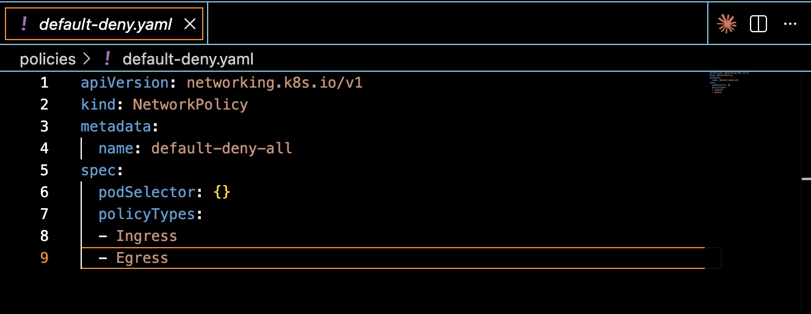
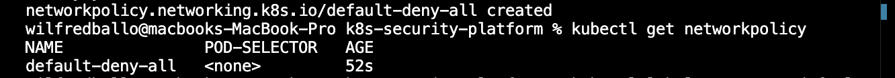
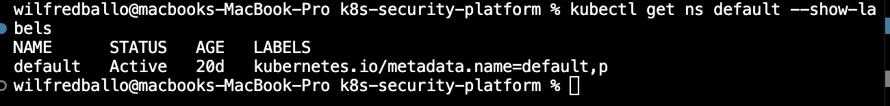

# Kubernetes Security Hardening Platform

A production-style Kubernetes security hardening project built on Google Kubernetes Engine (GKE) Autopilot.

This project demonstrates practical Kubernetes security controls including Network Policies, Pod Security Standards, policy enforcement, and security design considerations for managed Kubernetes environments.

---

## Architecture

- Google Kubernetes Engine (GKE) Autopilot
- Terraform Infrastructure as Code
- Kubernetes Network Policies
- Pod Security Standards (Restricted)
- Gatekeeper Policy Enforcement
- Security Documentation
- GitHub Version Control

---

## Security Controls Implemented

### 1. Default Deny Network Policy

A cluster-wide default deny policy was implemented to restrict all ingress and egress traffic unless explicitly allowed.

Location:

```
policies/default-deny.yaml
```

Benefits:

- Reduces attack surface
- Prevents unnecessary pod communication
- Enforces Zero Trust networking principles

---

### 2. Pod Security Standards (Restricted)

The default namespace was configured to enforce Kubernetes Restricted Pod Security Standards.

Verification:

```bash
kubectl get ns default --show-labels
```

Benefits:

- Restricts privileged containers
- Prevents host namespace access
- Enforces secure workload configurations

---

### 3. Gatekeeper Assessment

Gatekeeper was evaluated as a policy enforcement solution for Kubernetes admission control.

Documented findings:

```
docs/gatekeeper-autopilot-notes.md
```

---

### 4. Runtime Security Assessment

Falco runtime security monitoring was evaluated.

Documented findings:

```
docs/falco-autopilot-notes.md
```

Key Finding:

GKE Autopilot restricts the privileged access required by Falco.

This demonstrates an important trade-off between managed Kubernetes platforms and deep runtime visibility.

---

## Evidence

### Default Deny Network Policy



### Network Policy Verification



### Pod Security Enforcement



---

## Terraform

Infrastructure code is stored in:

```
terraform/
```

Includes:

- Provider configuration
- Cluster configuration
- Variables
- Outputs

---

## Skills Demonstrated

- Kubernetes Security
- GKE Autopilot
- Terraform
- Network Policies
- Pod Security Standards
- Security Architecture
- Policy Enforcement
- Git & GitHub
- Cloud Security Best Practices

---

## Lessons Learned

Managed Kubernetes services improve operational security and reduce administrative overhead.

However, they also introduce limitations around privileged security tooling such as Falco.

This project highlights the balance between operational simplicity and advanced security visibility.

---

## Author

Wilfred Ballo

GitHub:
https://github.com/wilfb-debug